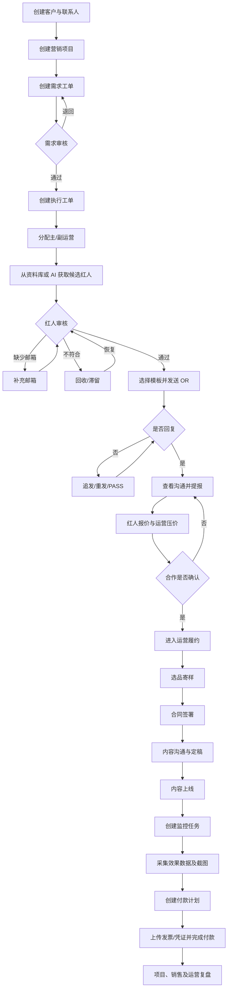
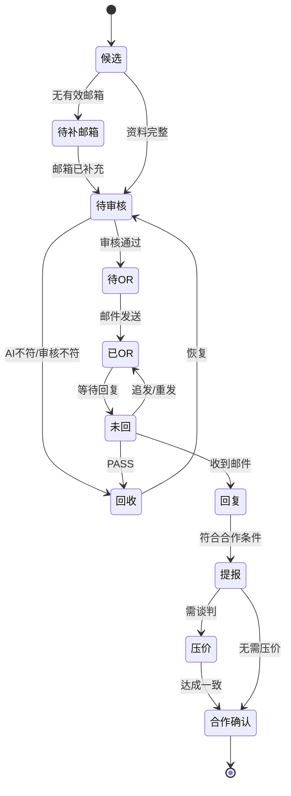
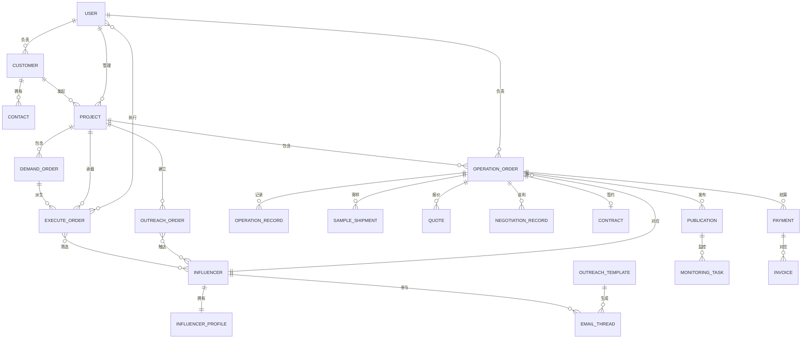

# MercuryDynamic 产品需求文档（PRD）

> 文档类型：基于现有操作录像分析的逆向 PRD  
> 产品类型：海外红人营销全生命周期管理平台  
> 文档版本：V0.9  
> 文档状态：评审稿  
> 更新日期：2026-09-18  
> 证据来源：《执行工单 - 1》《运营工单 - 1》《运营工单 - 2》及《MercuryDynamic 完整产品结构总结》  
> 特别说明：分析目录当前实际包含 3 份录像分析，未发现第 4 份。本 PRD 中未被录像直接证明的机制统一标记为“待确认”。

---

# 1. 文档目的

本文档从完整产品视角还原 MercuryDynamic 的产品目标、业务边界、信息架构、核心流程、功能需求、数据模型、权限模型和验收标准，用于：

- 统一业务、产品、设计、研发和测试对系统的理解；
- 为现有系统重构、功能补齐或新版本规划提供需求基线；
- 区分录像中已确认的能力、合理推断的机制和仍需业务确认的规则；
- 支撑后续原型设计、技术方案、排期拆解和测试用例编写。

本文档不是对单个录像操作的复述，也不代表现有系统所有隐藏能力均已被完整发现。

# 2. 产品概述

## 2.1 产品定位

MercuryDynamic 是一套面向红人营销代理商、品牌营销团队及其运营协作部门的业务管理平台。

系统以“客户—项目—工单—红人合作”为核心业务主线，覆盖：

1. 客户与项目建档；
2. 红人需求定义；
3. AI/规则辅助筛选红人；
4. Outreach 邮件建联；
5. 回复、提报、报价与压价；
6. 选品寄样、签约与内容运营；
7. 内容上线与效果监控；
8. 付款、发票与凭证管理；
9. 项目、销售和运营绩效统计。

本质上，该产品是一套以工单驱动的 **Influencer Marketing CRM + 项目履约 + 邮件协作 + 财务统计平台**。

## 2.2 业务背景

海外红人营销项目通常存在以下问题：

- 客户需求以聊天、邮件或表格传递，标准不统一；
- 红人资料分散在多个平台和个人文件中，难以复用；
- 单项目可能涉及数十至数百名红人，人工建联和追踪成本高；
- 红人从筛选到上线经历多个状态，容易遗漏或重复处理；
- 报价、压价、合同、寄样、内容和付款信息分散；
- 邮件无法稳定关联到项目和红人；
- 项目经理、运营、销售和财务之间缺少统一协作载体；
- 管理层难以准确获得项目进度、转化率、毛利和人员绩效。

MercuryDynamic 通过结构化数据、阶段化工单和统一状态管理解决上述问题。

## 2.3 产品愿景

建立统一的红人营销业务操作系统，使每一个客户需求、每一次红人触达、每一项合作履约和每一笔付款都可追踪、可协作、可统计、可复用。

# 3. 产品目标与成功指标

## 3.1 产品目标

### G1：提升红人筛选效率

将客户需求转化为标准筛选条件，通过多平台资料库和 AI/规则能力快速形成候选红人池。

### G2：提升建联和商务转化效率

通过模板、批量 OR、追发和回复聚合，减少重复邮件操作，并清晰管理红人所处阶段。

### G3：保证项目履约过程可控

统一管理选品、寄样、签约、内容、上线和监控材料，降低延期、漏项和信息丢失风险。

### G4：实现业务财务一体化

将报价、合同、付款计划、发票、凭证和项目利润连接起来，形成可追溯的资金链路。

### G5：沉淀可复用的数据资产

持续积累红人画像、均播、报价、建联、合作和内容表现，为后续项目选人提供依据。

## 3.2 建议成功指标

以下指标为产品化建议，现有录像未展示完整埋点口径：

- 需求工单创建至首批候选红人产出的平均时长；
- 单运营每日审核红人数；
- 有效邮箱率与邮箱补全率；
- OR 发送成功率；
- OR 回复率；
- 回复至提报转化率；
- 提报通过率；
- 合作确认率；
- 签约至上线平均周期；
- 内容按时上线率；
- 监控数据完整率；
- 付款按时完成率；
- 单项目毛利率；
- 红人资料复用率；
- 迷路邮件占比及人工匹配成功率。

# 4. 产品范围

## 4.1 本期范围

- 用户登录；
- 客户及联系人管理；
- 项目管理；
- 需求工单；
- 执行工单；
- OR 工单；
- 运营工单；
- 已办与邮件回复；
- Instagram、YouTube、TikTok 红人资料库；
- 红人资料、画像及均播维护；
- OR 邮件模板与批量发送；
- 回复、提报、报价和压价；
- 内容运营、选品寄样和合同；
- 上线信息及效果监控；
- 付款、发票和凭证；
- 迷路邮件处理；
- 运营库、项目品类和项目库；
- 首页、项目、销售和运营统计。

## 4.2 非本期范围

以下内容没有充分证据，不应在未经确认时直接纳入开发承诺：

- 面向客户或红人的独立门户；
- 红人自助注册和报价；
- 合同电子签章；
- 银行或支付平台自动付款；
- 税务申报；
- 社交平台广告投放管理；
- 自动生成营销创意；
- 完整的人力资源和薪酬管理；
- 客户发票及应收账款体系；
- 移动端原生 App。

# 5. 用户角色

## 5.1 角色定义

### 系统管理员

- 管理用户、角色、菜单和基础配置；
- 查看全量客户、项目、工单与统计；
- 处理异常数据和系统级配置。

状态：**待确认**。录像未展示后台权限页面。

### 销售 / 商务

- 维护客户及联系人；
- 创建或协助创建项目；
- 查看销售金额、项目毛利和回款；
- 关注客户与项目进展。

### 项目经理

- 负责项目建档、需求确认和项目整体推进；
- 审核需求或红人提报；
- 协调运营、商务和财务；
- 查看项目统计。

### 红人开发 / OR 运营

- 筛选和审核红人；
- 补充邮箱；
- 发送 OR 邮件并追踪回复；
- 提报红人、维护报价及压价记录。

### 内容运营

- 接手确认合作的红人；
- 维护选品、寄样、合同、内容和上线信息；
- 创建监控任务；
- 更新运营状态和红人资料。

### 财务

- 查看付款计划；
- 维护付款状态、发票和凭证；
- 核对价格变更；
- 查看项目金额与毛利。

### 管理层

- 查看首页及统计报表；
- 查看客户、项目和人员维度的经营表现；
- 关注转化漏斗、金额、毛利和异常。

## 5.2 权限原则

建议采用 RBAC（基于角色的权限控制）并叠加数据范围：

- **菜单权限**：决定用户可见的一级模块和页面；
- **操作权限**：决定新增、编辑、删除、审核、发送、导出和付款等能力；
- **数据权限**：支持本人、所属团队、所属客户/项目和全部数据；
- **字段权限**：报价、毛利、合同和付款凭证等敏感字段应按角色控制；
- **审计权限**：关键状态和金额变更需要保留操作者及时间。

具体角色权限矩阵需业务评审确认。

# 6. 核心业务概念

| 名称 | 定义 |
|---|---|
| 客户 | 采购红人营销服务的品牌或企业 |
| 项目 | 客户发起的一次营销 Campaign，是预算、需求、执行和核算的上层容器 |
| 需求工单 | 定义目标红人筛选条件及数量要求的任务 |
| 执行工单 | 将需求与项目关联，并分配给具体运营人员的执行任务 |
| OR 工单 | 承载红人审核、Outreach、回复、提报、压价等前端转化流程的工单 |
| 运营工单 | 承载合作确认后的寄样、签约、内容、上线、监控和付款流程的工单 |
| 红人 | Instagram、YouTube、TikTok 等平台上的内容创作者 |
| OR | Outreach，向红人发送合作邀请 |
| 提报 | 将符合条件或已回复的红人提交给项目侧评估 |
| 合理均播 | 用于评估红人内容表现的平均播放基准，计算口径待确认 |
| 回收 | 红人因 AI 或人工审核不符等原因退出当前处理流程 |
| 滞留 | 红人长期未继续流转的状态，具体进入规则待确认 |
| 迷路邮件 | 未能自动匹配红人、项目或工单的外部邮件 |

# 7. 信息架构

```text
MercuryDynamic
├─ 首页
├─ 客户
│  ├─ 客户管理
│  └─ 客户联系人
├─ 项目
│  └─ 项目管理
├─ 工单中心
│  ├─ 需求工单
│  ├─ 执行工单
│  ├─ OR 工单
│  ├─ 运营工单
│  ├─ 已办
│  └─ 邮件回复
├─ 资料库
│  ├─ Instagram 库
│  ├─ YouTube 库
│  ├─ TikTok 库
│  └─ AI 查询
├─ 财务管理
│  ├─ 未支付
│  └─ 已支付
├─ 邮件中心
│  └─ 迷路邮件
├─ 统计
│  ├─ 项目统计
│  ├─ 销售统计
│  └─ 运营统计
└─ 业务资料
   ├─ 运营库
   ├─ 项目品类
   └─ 项目库
```

# 8. 端到端业务流程



## 8.1 工单衔接原则

- 需求工单回答“需要什么样的红人”；
- 执行工单回答“哪个项目、由谁执行”；
- OR 工单回答“红人是否符合、是否联系、是否愿意合作”；
- 运营工单回答“合作如何履约、何时上线、效果如何、是否付款”。

四类工单的自动创建和一对多关系未被录像充分展示，需在业务评审中确认。

# 9. 功能需求

需求优先级说明：

- **P0**：构成端到端主流程的必要功能；
- **P1**：显著提升效率或保障业务完整性的功能；
- **P2**：体验优化、管理增强或后续扩展功能。

证据状态说明：

- **Confirmed**：录像明确展示；
- **Inferred**：根据页面或操作可合理推断；
- **TBD**：信息不足，需要业务确认。

## 9.1 账号与权限

### AUTH-001 账号登录

- 优先级：P0
- 证据：Confirmed
- 用户可使用用户名、密码和验证码登录系统。
- 登录成功后进入用户有权访问的默认页面。
- 登录失败时应明确提示账号、密码或验证码错误，但不得泄露账号是否存在。

### AUTH-002 微信扫码登录

- 优先级：P2
- 证据：Confirmed（入口可见）
- 登录页提供微信扫码登录入口。
- 微信身份与系统账号的绑定机制待确认。

### AUTH-003 访问拦截

- 优先级：P0
- 证据：Confirmed
- 未登录访问受限页面时，系统应跳转登录页。
- 登录后是否返回原访问页面待确认。

### AUTH-004 角色与数据权限

- 优先级：P0
- 证据：TBD
- 系统应按角色控制菜单、页面、操作和敏感字段。
- 系统应按用户归属控制客户、项目和工单数据范围。

## 9.2 客户管理

### CRM-001 客户列表

- 优先级：P0
- 证据：Confirmed
- 支持查看客户全称、简称、等级、地址、项目经理和商务归属。
- 支持分页、关键词查询和按归属筛选。

### CRM-002 新增与编辑客户

- 优先级：P0
- 证据：Confirmed
- 用户可录入客户全称、简称、企业地址、客户等级、项目经理和商务归属。
- 客户全称为必填字段。
- 客户简称是否允许重复需确认。

### CRM-003 客户联系人

- 优先级：P0
- 证据：Confirmed
- 一个客户可关联多个联系人。
- 支持在客户表单中新增联系人，也支持在联系人页面独立维护。
- 联系人至少包括姓名、手机；邮箱等扩展字段待确认。

### CRM-004 客户删除

- 优先级：P1
- 证据：Inferred
- 已被项目引用的客户不应直接物理删除。
- 建议采用停用或软删除，并保留历史业务数据。

## 9.3 项目管理

### PRJ-001 项目列表

- 优先级：P0
- 证据：Confirmed
- 支持按客户、项目名称、状态、负责人和时间查询项目。
- 列表展示客户、项目、预算、币种、平台、状态和项目经理。

### PRJ-002 新建与编辑项目

- 优先级：P0
- 证据：Confirmed
- 项目必须关联客户。
- 支持维护项目名称、预算、币种、状态、推广平台和项目经理。
- 推广平台支持 Instagram、YouTube、TikTok 多选。
- 币种至少支持 USD、EUR、RMB。

### PRJ-003 项目需求文档

- 优先级：P1
- 证据：Confirmed
- 支持上传项目需求文档。
- 应展示文件名、上传人、上传时间，并支持下载。
- 文件格式、大小和版本覆盖规则待确认。

### PRJ-004 项目状态

- 优先级：P0
- 证据：Confirmed
- 至少支持“进行中”和“结束”。
- 建议补充“草稿、暂停、已取消”状态。
- 结束项目后是否禁止新增工单需确认。

## 9.4 需求工单

### DEM-001 创建需求工单

- 优先级：P0
- 证据：Confirmed
- 系统自动生成唯一工单号。
- 用户录入工单名称、紧急程度、平台和目标红人数量。
- 工单必须关联项目的规则待确认。

### DEM-002 红人筛选条件

- 优先级：P0
- 证据：Confirmed
- 支持以下条件：
  - 平台；
  - 目标数量；
  - 粉丝量区间，可多选；
  - 合理均播区间；
  - 国家或地区；
  - 语言；
  - 最新视频时间范围；
  - 关键词；
  - 一级/二级品类；
  - Amazon Store Link；
  - AI 提供的博主内容标签；
  - AI 每日捞取数量。

### DEM-003 工单审核

- 优先级：P0
- 证据：Inferred
- 需求工单支持提交审核、通过和退回。
- 退回应记录原因。
- 审核角色、是否允许撤回、是否支持多级审核需确认。

### DEM-004 自动捞取候选红人

- 优先级：P1
- 证据：Inferred
- 系统根据需求条件从资料库或外部数据源获取候选红人。
- 应记录数据来源、命中条件和生成时间。
- AI 的具体职责、执行频率、数量上限和失败重试机制待确认。

## 9.5 执行工单

### EXE-001 创建执行工单

- 优先级：P0
- 证据：Confirmed
- 系统自动生成执行工单号。
- 用户选择需求工单和项目。
- 系统应校验需求工单与项目是否匹配。

### EXE-002 分配运营人员

- 优先级：P0
- 证据：Confirmed
- 支持设置主运营和副运营。
- 主运营至少一人；副运营人数上限待确认。
- 变更负责人应保留操作记录。

### EXE-003 执行进度

- 优先级：P1
- 证据：Inferred
- 应展示候选、已审核、已 OR、已回复、已提报、合作和上线数量。
- 可从执行工单进入对应 OR 或运营任务。

## 9.6 红人资料库

### INF-001 多平台红人库

- 优先级：P0
- 证据：Confirmed
- 分别提供 Instagram、YouTube 和 TikTok 红人列表。
- 红人主档应使用“平台 + 平台账号 ID”作为业务唯一标识。
- 同一自然人在多个平台上的账号合并规则待确认。

### INF-002 红人查询与筛选

- 优先级：P0
- 证据：Confirmed
- 支持按平台、红人 ID、国家地区、语言、粉丝量、博主类型、合理均播、项目、建联状态和报价状态筛选。
- 支持组合查询和重置条件。

### INF-003 红人基础信息

- 优先级：P0
- 证据：Confirmed
- 维护红人 ID、主页、平台、邮箱、国家、语言、粉丝量和博主类型。
- 主页和邮箱应支持格式校验。

### INF-004 红人画像与表现数据

- 优先级：P1
- 证据：Confirmed
- 维护男性/女性占比、年龄段占比、地区占比、互动率和均播。
- 均播至少包含全部视频、近 15 条、近 20 条和去置顶等口径。
- 百分比字段应校验范围；同维度占比总和应接近 100%。

### INF-005 红人导入与导出

- 优先级：P1
- 证据：Confirmed
- 支持批量导入或导出红人。
- 导入时应提供模板、字段校验、重复数据处理和失败明细。
- 导出内容应遵循当前用户的数据及字段权限。

### INF-006 数据采集

- 优先级：P1
- 证据：Inferred
- 系统可通过采集任务或外部接口补充红人数据。
- 应展示任务状态、成功数、失败数和最近更新时间。
- 数据来源、平台合规性和更新频率待确认。

## 9.7 OR 工单与商务转化

### OR-001 项目工单树

- 优先级：P0
- 证据：Confirmed
- 左侧按客户和项目展示工单树。
- 支持展开全部、折叠和项目切换。
- 选择项目后展示对应红人列表及阶段统计。

### OR-002 红人审核

- 优先级：P0
- 证据：Confirmed
- 运营可审核候选红人。
- 审核结果至少包括通过、人工不符和 AI 不符。
- 不符合的红人进入回收区。

### OR-003 邮箱补充

- 优先级：P0
- 证据：Confirmed
- 候选红人按有邮箱、无邮箱和补充邮箱分类。
- 邮箱补充后应重新校验，并允许进入待 OR 状态。

### OR-004 OR 模板管理

- 优先级：P0
- 证据：Confirmed
- 支持模板列表、新增、编辑和选择。
- 模板包括名称、邮件标题、富文本正文、变量和附件。
- 发送前应预览变量替换结果。
- 未解析变量不得静默发送。

### OR-005 批量 OR

- 优先级：P0
- 证据：Inferred
- 用户选择红人后可一键发送 OR 邮件。
- 发送前应展示目标数量、模板和发送账号，并进行二次确认。
- 系统应记录发送结果和失败原因，避免重复发送。
- 邮件限流、退信和重试规则待确认。

### OR-006 未回复跟进

- 优先级：P0
- 证据：Confirmed
- 未回复红人进入“未回”列表。
- 支持一键追发、一键重发和一键 PASS。
- 追发次数、间隔和停止条件待确认。

### OR-007 回复与提报

- 优先级：P0
- 证据：Confirmed
- 红人回复后进入“回复”阶段。
- 运营可查看完整邮件上下文。
- 满足条件的红人可进入提报阶段。
- 提报对象、通过规则和退回规则待确认。

### OR-008 报价与压价

- 优先级：P0
- 证据：Confirmed
- 支持记录报价明细、总价、币种和有效状态。
- 支持记录每次压价内容、时间和人员。
- 价格变更应形成不可覆盖的历史记录。

### OR-009 回收与恢复

- 优先级：P1
- 证据：Confirmed
- 回收区展示 AI 不符和审核不符的红人。
- 支持批量恢复选中红人。
- 恢复后的目标阶段和重复审核规则待确认。

### OR-010 滞留

- 优先级：P1
- 证据：Confirmed（页签可见）
- 展示长时间未继续处理的红人。
- 自动进入滞留的时间阈值、人工移入和恢复规则待确认。

## 9.8 运营工单与合作履约

### OPS-001 运营红人列表

- 优先级：P0
- 证据：Confirmed
- 选择客户/项目后展示红人 ID、主页、平台、总价、合理均播、运营负责人、运营状态和财务状态。
- 支持进入红人详情和编辑运营信息。

### OPS-002 运营负责人及状态

- 优先级：P0
- 证据：Confirmed
- 支持设置运营负责人。
- 运营状态至少包括运营中、已上线、已完成和已取消。
- 状态变更应记录操作人和时间。

### OPS-003 内容运营记录

- 优先级：P0
- 证据：Confirmed
- 支持新增富文本运营记录。
- 可选择记录类别并提醒相关人员。
- 支持按时间倒序查看历史记录。

### OPS-004 选品与寄样

- 优先级：P0
- 证据：Confirmed
- 记录选品、收件人、地址和快递单号。
- 建议扩展寄样状态：待寄出、已寄出、已签收、异常。
- 物流自动查询能力待确认。

### OPS-005 合同管理

- 优先级：P0
- 证据：Confirmed
- 维护合同发送日期、签署日期、付款周期和预计付款日期。
- 支持上传并下载合同 PDF。
- 合同替换应保留历史版本。

### OPS-006 上线信息

- 优先级：P0
- 证据：Confirmed
- 维护视频地址、平台、监控时间范围和发布时间。
- 支持维护 Spark Ad Code、最终定稿、甲方官方 Link、上线共创和文案 Tag 一致性。
- 链接和时间字段应进行格式校验。

### OPS-007 上线监控

- 优先级：P0
- 证据：Confirmed
- 可为上线内容创建监控任务。
- 展示播放、点赞及其他互动数据。
- 支持上传 Story、Reel 等截图证据。
- 自动抓取接口、同步频率和平台授权方式待确认。

### OPS-008 红人信息修正

- 优先级：P1
- 证据：Confirmed
- 运营可在合作过程中修正红人基础信息、画像和均播。
- 修改应回写红人资料库。
- 建议保留修改前后值和来源。

## 9.9 邮件中心

### MAIL-001 邮件沟通详情

- 优先级：P0
- 证据：Confirmed
- 按红人展示收件、发件和草稿记录。
- 邮件应展示主题、正文、附件、发件人、收件人和时间。

### MAIL-002 邮件回复聚合

- 优先级：P0
- 证据：Confirmed
- 聚合需要运营处理的红人回复。
- 列表至少展示红人 ID、工单名称和最后收邮时间。
- 支持进入邮件详情。

### MAIL-003 邮件自动关联

- 优先级：P0
- 证据：Inferred
- 系统应尝试将邮件关联到红人、项目和工单。
- 推荐匹配优先级：会话标识 > 邮箱地址 > 邮件主题标识 > 人工匹配。
- 实际匹配逻辑需确认。

### MAIL-004 迷路邮件

- 优先级：P0
- 证据：Confirmed
- 未自动匹配的邮件进入迷路邮件列表。
- 用户可查看和编辑正文、附件及关联信息。
- 成功关联后应从待处理列表移除，并进入对应沟通记录。

### MAIL-005 邮件异常处理

- 优先级：P1
- 证据：TBD
- 应处理发送失败、退信、重复邮件和附件异常。
- 应记录错误原因并支持有权限用户重试。

## 9.10 财务管理

### FIN-001 红人价格

- 优先级：P0
- 证据：Confirmed
- 维护红人总价、报价明细和币种。
- 每次价格变更必须形成历史记录。

### FIN-002 新增付款计划

- 优先级：P0
- 证据：Confirmed
- 支持录入付款类型、金额、币种和计划时间。
- 付款金额不得为负数。
- 累计付款是否允许超过合同总价需确认。

### FIN-003 付款状态

- 优先级：P0
- 证据：Confirmed
- 至少支持未支付/待提交、财务支付中和付款完成。
- 状态流转应由有权限的用户操作。
- 支付完成时应记录实际付款时间。

### FIN-004 凭证与发票

- 优先级：P0
- 证据：Confirmed
- 支持上传付款凭证和发票附件。
- 文件应展示名称、上传人和上传时间。
- 文件删除和替换应保留审计记录。

### FIN-005 财务聚合列表

- 优先级：P0
- 证据：Confirmed
- 分别提供未支付和已支付列表。
- 支持按客户、项目、红人、状态、时间和币种筛选。
- 支持从列表进入或编辑付款详情。

### FIN-006 业务自动生成付款

- 优先级：P1
- 证据：TBD
- 合同或合作确认后是否自动创建付款计划需确认。
- 若自动创建，应明确金额来源、付款周期和人工确认节点。

## 9.11 运营知识与项目资料

### KB-001 运营库

- 优先级：P1
- 证据：Confirmed
- 支持新增和维护运营相关资料。
- 支持名称、类型、备注、链接、图片或文件。

### KB-002 项目品类

- 优先级：P1
- 证据：Confirmed
- 支持维护项目品类资料。
- 品类与需求工单标签之间的关系待确认。

### KB-003 项目库

- 优先级：P1
- 证据：Confirmed
- 支持沉淀项目相关链接和文件。
- 应按客户及项目控制访问范围。

## 9.12 首页与统计分析

### BI-001 首页看板

- 优先级：P1
- 证据：Confirmed
- 展示销售额、订单量、支付笔数、运营活动效果和销售排行。
- 指标统计周期和口径需统一。

### BI-002 项目统计

- 优先级：P0
- 证据：Confirmed
- 按客户和项目展示签约、推进、上线、待回款及毛利数据。
- 支持从客户下钻至项目。
- 支持自然周、月、季和年等周期。

### BI-003 销售统计

- 优先级：P1
- 证据：Confirmed
- 展示签约红人金额、推进金额、上线视频金额和毛利率。
- 支持周期切换和趋势对比。

### BI-004 运营统计

- 优先级：P1
- 证据：Confirmed
- 按运营人员统计签约、推进和上线红人数量。
- 支持人员绩效排名。
- 排名是否直接用于考核需确认。

### BI-005 转化漏斗

- 优先级：P1
- 证据：Confirmed
- 统计审核、OR、回复、提报、通过、签约和上线数量及转化率。
- 各阶段去重规则和归属日期口径需确认。

### BI-006 报表导出

- 优先级：P2
- 证据：TBD
- 建议支持按当前筛选条件导出项目、销售和运营统计。
- 导出字段应遵循权限配置。

# 10. 状态模型

## 10.1 需求工单状态

建议状态：

```text
草稿 → 待审核 → 已通过 → 执行中 → 已完成
          └→ 已退回 → 草稿
任意非终态 → 已取消
```

录像仅能推断存在审核，具体状态名称和终态规则待确认。

## 10.2 红人 OR 状态



“OR”和“未回”可能是同一红人在不同视图中的标签，而非严格互斥状态，需结合数据库设计确认。

## 10.3 运营状态

录像确认：

```text
运营中 → 已上线 → 已完成
   └────────→ 已取消
```

建议增加“待运营”和“暂停”，以区分已转入运营但尚未开始的记录。

## 10.4 财务状态

```text
待提交/未支付 → 财务支付中 → 付款完成
                     └→ 支付失败/退回（建议）
```

付款状态与发票状态应拆分维护，避免使用单一状态表达两个流程。

# 11. 关键业务规则

## 11.1 数据唯一性

- 客户应有稳定唯一 ID，不应仅以简称识别；
- 项目名称可重复，但“客户 + 项目名称 + 项目周期”建议唯一；
- 红人使用“平台 + 平台账号 ID”作为平台级唯一键；
- 工单号必须全局唯一且创建后不可修改；
- 邮件应保留原始 Message-ID，用于会话关联和去重。

## 11.2 金额与币种

- 项目预算、红人报价、合同金额和付款金额必须携带币种；
- 不同币种不得直接相加；
- 跨币种统计应保存汇率、汇率日期和折算币种；
- 价格变更不得覆盖历史记录；
- 毛利计算公式及税费、汇率口径需业务确认。

## 11.3 时间

- 邮件、合同、上线和付款记录应保存时区；
- 发布时间需区分 PST/项目时区与国内时间；
- 报表按自然周、月、季、年聚合；
- 指标归属日期应明确采用签约日、计划日、实际支付日或上线日。

## 11.4 批量操作

- 批量 OR、追发、PASS、恢复和导出前应展示影响条数；
- 发送邮件、状态变更等不可逆操作应二次确认；
- 批量任务应异步执行并展示成功、失败和跳过数量；
- 单条失败不得导致整批任务回滚；
- 应提供失败明细和重试入口。

## 11.5 文件管理

- 合同、发票、凭证和监控截图应按业务类型分类；
- 文件应记录上传人、上传时间、原文件名和关联对象；
- 敏感文件下载应受权限控制；
- 支持格式、大小、病毒扫描及存储周期需技术方案明确。

## 11.6 审计

以下操作必须写入审计日志：

- 客户、项目和工单删除或停用；
- 工单审核和状态回退；
- 红人负责人变更；
- 批量邮件发送；
- 报价和价格变更；
- 合同替换；
- 付款新增、修改和完成；
- 凭证、发票删除；
- 红人核心数据修正。

# 12. 数据模型

## 12.1 核心实体



## 12.2 关键实体字段

### Customer

- customer_id
- full_name
- short_name
- level
- address
- project_manager_id
- business_owner_id
- status
- created_at / updated_at

### Project

- project_id
- customer_id
- name
- budget
- currency
- platforms
- status
- project_manager_id
- start_date / end_date
- requirement_document

### DemandOrder

- demand_order_id
- order_no
- project_id
- name
- urgency
- platform
- target_count
- follower_ranges
- average_view_range
- countries
- languages
- latest_content_range
- keywords
- categories
- ai_tags
- ai_daily_limit
- status

### Influencer

- influencer_id
- platform
- platform_account_id
- profile_url
- email
- country
- language
- creator_type
- follower_count
- contact_status
- quote_status
- data_source
- last_synced_at

### OperationOrder

- operation_order_id
- project_id
- influencer_id
- owner_id
- operation_status
- finance_status
- agreed_price
- currency
- started_at
- completed_at

### EmailThread

- thread_id
- message_id
- influencer_id
- project_id
- order_id
- direction
- from_address
- to_addresses
- subject
- body
- attachments
- sent_or_received_at
- match_status

### Publication

- publication_id
- operation_order_id
- platform
- content_url
- publish_time
- timezone
- monitoring_start_at
- monitoring_end_at
- spark_ad_code
- final_content_file
- official_link
- collaboration_flag
- tag_check_status

### Payment

- payment_id
- operation_order_id
- payment_type
- amount
- currency
- planned_at
- paid_at
- status
- invoice_files
- proof_files
- remark

# 13. 页面与导航要求

## 13.1 全局导航

- 左侧导航承载完整模块树；
- 顶部 Tab 用于保留高频页面和多任务切换；
- 页面 Tab 名称应与左侧菜单一致，避免“执行工单/运营工单”等概念混淆；
- 离开存在未保存内容的页面或弹窗时应提示用户；
- 用户重新登录后是否恢复已打开 Tab 待确认。

## 13.2 列表页通用规范

- 提供关键词和业务条件筛选；
- 支持查询、重置、分页和列排序；
- 展示当前筛选条件和结果总数；
- 支持按权限导出；
- 空状态、加载状态、错误状态应明确区分；
- 批量操作仅在选中数据后可用；
- 金额、时间、状态应使用统一格式和颜色规范。

## 13.3 弹窗与详情页

- 简单编辑使用弹窗；
- 字段较多、存在多个业务 Tab 的红人详情建议使用独立详情页或全屏抽屉；
- 保存成功后更新来源列表；
- 关闭未保存表单时提示；
- 禁止出现弹窗多层无限嵌套。

# 14. 通知与待办

现有录像出现提醒人、邮件回复和已办入口，但完整通知机制未展示。建议：

- 新执行工单分配时通知主/副运营；
- 新邮件回复时通知当前负责人；
- 提报待审核时通知项目经理；
- 合同临近签署或付款日期时提醒；
- 内容临近上线和监控结束时提醒；
- 付款被退回或完成时通知运营及项目经理；
- 异常采集和迷路邮件积压时通知管理员；
- 通知应支持已读/未读，并能跳转业务对象。

此章节整体为 **P1、待确认**。

# 15. 统计口径建议

## 15.1 红人漏斗

- 候选数：进入当前项目候选池的去重红人数；
- 审核通过数：人工审核结果为通过的去重红人数；
- 已 OR 数：至少成功发送一次 OR 邮件的去重红人数；
- 回复数：收到至少一封有效回复的去重红人数；
- 提报数：提交至项目侧评估的去重红人数；
- 提报通过数：项目侧确认可合作的去重红人数；
- 签约数：存在有效已签合同的去重红人数；
- 上线数：存在有效上线链接的去重红人数。

## 15.2 转化率

- 审核通过率 = 审核通过数 / 已审核数；
- OR 回复率 = 回复数 / OR 发送成功红人数；
- 提报率 = 提报数 / 回复数；
- 提报通过率 = 提报通过数 / 提报数；
- 签约率 = 签约数 / 提报通过数；
- 上线率 = 上线数 / 签约数。

## 15.3 金额

- 报价金额：红人初始有效报价；
- 签约金额：已签合同约定金额；
- 推进金额：达到业务定义推进阶段的合作金额，阶段定义待确认；
- 上线金额：已上线合作对应金额；
- 已付款金额：付款状态为完成的金额；
- 待付款金额：应付金额减已付款金额；
- 毛利：客户项目收入减红人成本及其他纳入成本；
- 毛利率 = 毛利 / 项目收入。

跨币种报表必须先统一折算口径。

# 16. 非功能需求

## 16.1 性能

- 常规列表首屏建议在 2 秒内完成；
- 普通筛选查询建议在 3 秒内返回；
- 大批量导入、导出、采集和邮件发送采用异步任务；
- 红人详情各 Tab 可按需加载，避免一次请求全部数据。

## 16.2 可用性

- 关键业务应支持明确的加载、成功、失败和空状态；
- 异步任务失败应可重试；
- 邮件、付款和状态更新不得因页面刷新重复提交；
- 外部平台或邮件服务异常不应阻塞系统内其他操作。

## 16.3 安全

- 密码必须加密存储；
- 登录及敏感操作应具备频率限制；
- 合同、发票和凭证采用私有访问；
- 导出和文件下载应校验权限；
- 富文本内容必须防止 XSS；
- 文件上传应限制类型、大小并进行安全扫描；
- 邮件凭证和外部平台 Token 不得暴露在前端；
- 关键业务操作保留审计日志。

## 16.4 数据合规

- 红人邮箱、地址和画像属于敏感业务数据，应进行访问控制；
- 明确红人数据采集来源、合法依据和保留期限；
- 支持按要求更正或删除个人数据；
- 跨境数据存储和传输要求需结合法务意见确认。

## 16.5 兼容性

- 优先支持当前主流桌面版 Chrome；
- 建议兼容 Edge 和 Safari 最新两个主版本；
- 复杂工单及数据表格以桌面端为主要使用场景。

## 16.6 可观测性

- 记录邮件发送、采集同步、文件上传和统计任务的执行状态；
- 外部接口异常应具备日志、告警和关联请求 ID；
- 支持按工单号、红人 ID、邮件 Message-ID 和付款 ID 排查问题。

# 17. 埋点需求

建议记录以下事件：

- login_success / login_failed；
- customer_created；
- project_created；
- demand_order_submitted / approved / rejected；
- execute_order_assigned；
- influencer_imported / reviewed / restored；
- email_enriched；
- or_send_started / succeeded / failed；
- or_followup_sent；
- influencer_replied；
- influencer_submitted / approved；
- quote_created / price_changed；
- contract_uploaded / signed；
- sample_shipped；
- publication_created；
- monitoring_synced / sync_failed；
- payment_created / processing / completed；
- lost_email_matched；
- report_viewed / exported。

每个事件至少携带：

- user_id；
- customer_id；
- project_id；
- order_id；
- influencer_id（适用时）；
- event_time；
- source_page；
- result；
- failure_reason（失败时）。

# 18. 核心验收标准

## AC-01 客户到执行工单

1. 用户可创建带联系人的客户；
2. 可在该客户下创建项目并设置预算、币种、平台和负责人；
3. 可创建包含红人筛选条件的需求工单；
4. 可基于需求和项目创建执行工单；
5. 可为执行工单分配主/副运营；
6. 各对象之间的关联可追溯。

## AC-02 红人筛选与 OR

1. 用户可从多平台资料库查询红人；
2. 可将红人加入目标项目或工单；
3. 可完成审核、邮箱补充和回收；
4. 可选择 OR 模板并预览；
5. 可批量发送，并获得逐条成功/失败结果；
6. 发送成功后红人进入正确阶段；
7. 未回复红人可追发或 PASS；
8. 红人回复后可在邮件回复及沟通详情中查看。

## AC-03 商务转运营

1. 用户可记录红人报价和压价历史；
2. 红人合作确认后可进入运营工单；
3. 运营工单保留项目、红人、金额和负责人关联；
4. 所有阶段变化均记录操作人和时间。

## AC-04 合作履约

1. 用户可记录内容运营和选品寄样；
2. 可维护合同关键日期并上传合同；
3. 可录入上线链接、平台和发布时间；
4. 可创建监控任务并查看数据；
5. 可上传监控截图；
6. 红人资料修正可同步至资料库。

## AC-05 财务结算

1. 用户可基于运营工单创建一个或多个付款计划；
2. 可维护金额、币种、计划时间和付款状态；
3. 可上传发票及付款凭证；
4. 价格变更保留历史；
5. 付款完成后可在已支付列表查询；
6. 未完成付款可在未支付列表查询；
7. 未授权用户无法查看或修改敏感财务信息。

## AC-06 统计

1. 项目统计能够按客户下钻到项目；
2. 支持至少自然周和自然年周期；
3. 红人漏斗各阶段数量可与明细对账；
4. 金额指标可追溯至合同、报价或付款明细；
5. 运营统计可追溯至负责人名下工单；
6. 跨币种数据使用明确汇率口径。

## AC-07 异常邮件

1. 无法自动关联的邮件进入迷路邮件；
2. 用户可查看正文和附件；
3. 可手动关联红人或工单；
4. 关联成功后邮件进入目标沟通记录；
5. 同一邮件不会被重复处理。

# 19. 依赖与风险

## 19.1 外部依赖

- 邮件发送和收取服务；
- Instagram、YouTube、TikTok 数据接口或第三方采集服务；
- 文件对象存储；
- 微信登录；
- AI 模型或标签服务；
- 汇率数据源；
- 可能存在的飞书文件服务。

## 19.2 主要风险

### 平台数据合规风险

社交平台数据采集可能受接口授权、频控、平台政策和地区法规限制。

### 邮件送达风险

大批量 OR 容易触发邮件服务限流、退信或垃圾邮件策略，需要发送域名、频率和信誉管理。

### 状态口径风险

审核、OR、未回、回复、提报、压价、运营和财务状态可能存在重叠。若不先统一状态机，会导致统计与列表不一致。

### 金额口径风险

多币种、报价变更、合同金额和分期付款之间的关系若定义不清，会直接影响毛利和付款统计。

### 权限风险

客户、红人、合同、价格、付款和凭证均涉及敏感数据。仅依靠菜单隐藏不足以保障安全。

### 数据质量风险

红人画像、均播和监控数据同时存在人工修正与自动采集来源，需要明确优先级、时间戳和可信度。

# 20. 待确认问题

## 20.1 工单体系

1. 需求工单、执行工单、OR 工单和运营工单之间分别是一对一还是一对多？
2. 各工单由系统自动创建还是人工创建？
3. “已办”的归档条件是什么？
4. “滞留”的进入和退出规则是什么？
5. 工单是否允许跨项目迁移红人？

## 20.2 审核与协作

1. 需求、红人提报、价格和付款分别由谁审核？
2. 是否存在多级审批、撤回、加签或转交？
3. 主运营和副运营的权限有何差异？
4. 各角色的数据范围如何确定？

## 20.3 AI 与数据

1. AI 负责标签生成、候选红人检索还是自动审核？
2. Instagram、YouTube、TikTok 数据来自官方 API、第三方服务还是内部采集？
3. “合理均播”的计算公式和更新周期是什么？
4. 人工修正和自动采集冲突时采用哪个值？
5. 监控数据为 0 或 Loading 时应如何提示和重试？

## 20.4 邮件

1. OR 使用哪些发件账号，账号如何分配？
2. 模板变量全集及缺失变量处理规则是什么？
3. 追发间隔、次数及发送限额是什么？
4. 邮件通过哪些字段自动匹配红人和工单？
5. 迷路邮件允许修改原始正文，还是仅能修改转发/回复内容？

## 20.5 合同与财务

1. 合同金额与红人最终报价是否必须一致？
2. 合作确认或合同签署后是否自动生成付款计划？
3. 是否允许分期付款、部分付款、超额付款和退款？
4. 发票状态和付款状态是否独立？
5. 毛利包含哪些成本，汇率取哪个日期？
6. “财务支付中”是否对应正式审批流程？

## 20.6 统计

1. “推进金额”的业务定义是什么？
2. OR 数量是已发送邮件数还是去重红人数？
3. 各阶段指标按进入阶段时间还是当前状态统计？
4. 人员绩效按主运营、实际操作人还是项目归属计算？
5. 历史数据变更后，报表是否回溯重算？

# 21. 建议实施优先级

## 第一阶段：主数据与任务建立

- 登录与权限基础；
- 客户和联系人；
- 项目管理；
- 红人资料库；
- 需求工单；
- 执行工单。

## 第二阶段：建联与商务转化

- 红人审核；
- 邮箱补充；
- OR 模板；
- 批量发送及结果；
- 回复聚合；
- 提报、报价和压价；
- 回收与滞留。

## 第三阶段：运营履约

- 运营分配及状态；
- 内容运营；
- 选品寄样；
- 合同；
- 上线信息；
- 监控任务和证据；
- 红人数据回写。

## 第四阶段：财务与经营分析

- 付款计划；
- 发票和凭证；
- 财务状态；
- 项目、销售和运营统计；
- 漏斗与经营看板。

## 第五阶段：自动化与治理

- AI/规则自动捞取；
- 社交平台数据同步；
- 邮件自动关联；
- 自动提醒与异常告警；
- 数据质量、审计和合规治理。

# 22. 版本结论

现有证据足以确认 MercuryDynamic 已具备红人营销主流程的大部分页面和操作能力。产品的核心竞争力不在某个单点功能，而在于把以下四条链路连接到同一客户和项目上下文中：

1. **需求链路**：客户 → 项目 → 需求 → 执行；
2. **转化链路**：候选红人 → 审核 → OR → 回复 → 提报 → 报价/压价；
3. **履约链路**：寄样 → 签约 → 内容 → 上线 → 监控；
4. **资金链路**：报价 → 合同 → 付款计划 → 发票/凭证 → 项目毛利。

下一轮产品评审应优先确认工单关系、状态机、角色权限、金额口径和外部数据机制。上述五项决定数据库结构和系统边界，应在视觉改版或功能扩展前完成定义。
