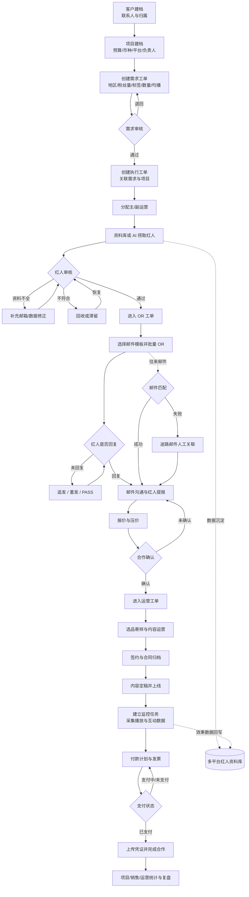
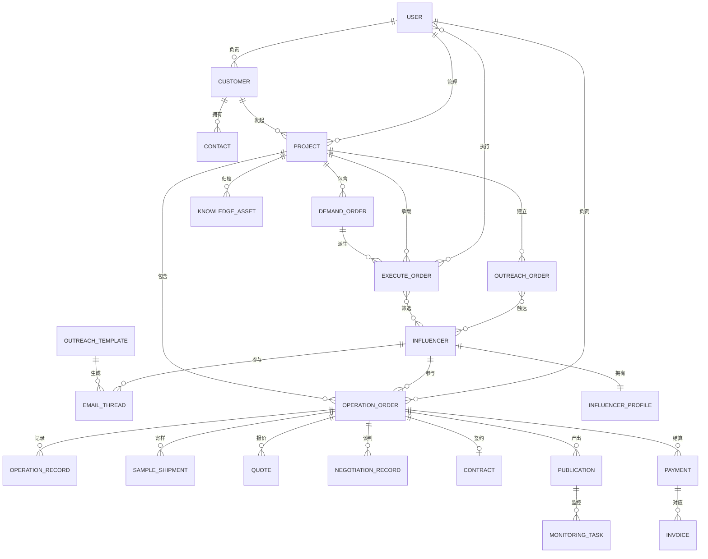

# MercuryDynamic 完整产品结构总结

> 分析口径：以完整产品和端到端业务链路为单位合并，不按单个视频拆分。
>
> 当前证据范围：目录中实际包含 3 份分析结果，分别来自《执行工单 - 1》《运营工单 - 1》《运营工单 - 2》；未发现第 4 份分析文件。因此，下文是基于现有全部证据还原的产品结构，缺失部分按 Inferred 或 Unknown 标记。

# 1. 系统定位

MercuryDynamic 是一套面向海外红人营销代理商或品牌营销团队的项目运营管理系统。它以“客户—项目—工单—红人合作”为主线，覆盖从客户与项目建档、红人需求定义、AI/规则筛选、商务触达、报价谈判、签约寄样、内容上线、效果监控，到付款结算和经营统计的完整流程。

系统主要解决以下问题：

1. **营销需求结构化**：将客户对平台、地区、粉丝量、内容标签、数量等要求转化为可执行的需求工单。
2. **红人资源集中管理**：沉淀 Instagram、YouTube、TikTok 红人资料、画像、均播、报价与历史建联数据。
3. **批量建联与邮件追踪**：使用模板批量发送 Outreach 邮件，处理追发、回复、提报、压价和异常邮件。
4. **合作执行标准化**：把选品寄样、合同、内容运营、上线监控和证据材料统一归档到红人合作记录。
5. **跨角色协同**：连接项目经理、销售、运营和财务，明确项目及红人的负责人和执行状态。
6. **资金与经营核算**：管理报价、价格变更、付款计划、凭证和发票，并按项目、人员和周期统计金额、毛利与转化。

从产品边界看，它不是单纯的 CRM、邮件工具或红人数据库，而是一套以工单驱动的 **KOL/Influencer Marketing 全生命周期业务中台**。

# 2. 一级功能模块

1. **首页与经营看板**
   - 销售额、订单量、支付笔数、运营活动效果和排行概览。
2. **客户管理**
   - 客户档案、联系人、项目经理与商务归属。
3. **项目管理**
   - 项目建档、预算、币种、状态、推广平台和需求文档。
4. **工单中心**
   - 需求工单、执行工单、OR 工单、运营工单、已办工单、邮件回复。
5. **红人资料库**
   - Instagram、YouTube、TikTok 数据库，AI 查询及多维筛选。
6. **红人合作执行**
   - 运营分配、内容记录、选品寄样、报价压价、签约、上线与监控。
7. **邮件与触达**
   - OR 模板、批量发送、追发、沟通历史、回复处理和迷路邮件。
8. **合同与财务**
   - 合同文件、报价及价格变更、付款计划、发票、凭证和支付状态。
9. **运营知识与项目资料**
   - 运营库、项目品类、项目库及文件/链接归档。
10. **统计分析**
    - 项目统计、运营统计、销售统计、金额与转化漏斗分析。
11. **账号与权限**
    - 账号密码、验证码、微信登录；角色和数据权限机制尚未被充分展示。

# 3. 功能树

```text
MercuryDynamic
├─ 首页与经营看板
│  ├─ 核心经营指标
│  │  ├─ 销售额与订单量
│  │  └─ 支付笔数与活动效果
│  └─ 排行与趋势
│     ├─ 销售排行
│     └─ 周期趋势
├─ 客户管理
│  ├─ 客户档案
│  │  ├─ 新增、编辑、删除客户
│  │  ├─ 客户等级与企业地址
│  │  └─ 项目经理、商务归属
│  └─ 客户联系人
│     ├─ 联系人列表
│     └─ 随客户新增联系人
├─ 项目管理
│  ├─ 项目档案
│  │  ├─ 客户与项目名称
│  │  ├─ 预算、币种与状态
│  │  └─ 项目经理
│  ├─ 推广范围
│  │  └─ Instagram / YouTube / TikTok
│  └─ 项目资料
│     └─ 需求文档上传
├─ 工单中心
│  ├─ 需求工单
│  │  ├─ 平台、地区、语言与数量
│  │  ├─ 粉丝量、均播与时间范围
│  │  ├─ 关键词、品类与 AI 标签
│  │  └─ 审核及红人捞取条件
│  ├─ 执行工单
│  │  ├─ 关联需求工单
│  │  ├─ 关联项目
│  │  └─ 分配主/副运营
│  ├─ OR 工单
│  │  ├─ AI 数据
│  │  │  ├─ 有邮箱红人
│  │  │  ├─ 无邮箱红人
│  │  │  └─ 补充邮箱
│  │  ├─ 人工审核
│  │  ├─ 待 OR / 已 OR
│  │  ├─ 未回复 / 回复
│  │  ├─ 提报 / 压价
│  │  └─ 回收 / 滞留
│  ├─ 运营工单
│  │  ├─ 客户—项目树
│  │  ├─ 红人列表与负责人
│  │  ├─ 运营状态
│  │  │  ├─ 运营中
│  │  │  ├─ 已上线
│  │  │  ├─ 已完成
│  │  │  └─ 已取消
│  │  └─ 红人合作详情
│  ├─ 已办
│  │  └─ 已处理工单
│  └─ 邮件回复
│     ├─ 回复列表
│     └─ 邮件沟通详情
├─ 红人资料库
│  ├─ Instagram 库
│  ├─ YouTube 库
│  ├─ TikTok 库
│  ├─ AI 查询
│  ├─ 多维检索
│  │  ├─ 平台、ID、地区与语言
│  │  ├─ 粉丝量、类型与均播
│  │  └─ 建联、报价与项目状态
│  └─ 红人数据维护
│     ├─ 邮箱和主页
│     ├─ 性别、年龄与地区画像
│     ├─ 互动率与均播
│     └─ 导入、导出与修正
├─ 红人合作执行
│  ├─ 内容运营
│  │  ├─ 富文本沟通/执行日志
│  │  └─ 提醒相关人员
│  ├─ 选品寄样
│  │  ├─ 选品记录
│  │  ├─ 收件信息
│  │  └─ 快递单号
│  ├─ 商务谈判
│  │  ├─ 红人报价
│  │  └─ 压价记录
│  ├─ 签约
│  │  ├─ 合同发送与签署日期
│  │  ├─ 付款周期
│  │  └─ 合同文件
│  └─ 上线与监控
│     ├─ 视频地址与平台
│     ├─ 发布时间与监控周期
│     ├─ 定稿、共创、Tag 与投流信息
│     ├─ 播放及互动数据
│     └─ Story / Reel 截图证据
├─ 邮件与触达
│  ├─ OR 模板
│  │  ├─ 标题与富文本正文
│  │  ├─ 变量替换
│  │  └─ 附件
│  ├─ 批量触达
│  │  ├─ 一键 OR
│  │  ├─ 一键追发/重发
│  │  └─ 一键 PASS
│  ├─ 沟通记录
│  │  ├─ 收件
│  │  ├─ 发件
│  │  └─ 草稿
│  └─ 迷路邮件
│     ├─ 未匹配邮件列表
│     ├─ 正文与附件编辑
│     └─ 手动关联红人/工单
├─ 合同与财务
│  ├─ 报价与价格
│  │  ├─ 明细报价与总价
│  │  └─ 价格变更历史
│  ├─ 付款
│  │  ├─ 付款计划
│  │  ├─ 未支付 / 支付中
│  │  ├─ 已支付
│  │  └─ 付款凭证
│  ├─ 发票
│  │  └─ 发票附件
│  └─ 合同
│     ├─ 合约关键日期
│     └─ PDF 文件
├─ 运营知识与项目资料
│  ├─ 运营库
│  ├─ 项目品类
│  └─ 项目库
│     ├─ 链接
│     └─ 图片/文件
├─ 统计分析
│  ├─ 项目统计
│  │  ├─ 签约、推进与上线金额
│  │  ├─ 待回款与毛利
│  │  └─ 客户—项目下钻
│  ├─ 运营统计
│  │  ├─ 签约、推进与上线红人数
│  │  └─ 员工绩效排名
│  └─ 销售统计
│     ├─ 金额与毛利率
│     ├─ 审核、OR、提报与上线漏斗
│     └─ 周/月/季/年切换
└─ 账号与权限
   ├─ 账号密码与验证码登录
   ├─ 微信扫码登录
   └─ 角色、菜单和数据权限（待确认）
```

# 4. 页面地图

| 页面 | 主要功能 | 入口 | 关联页面 |
|---|---|---|---|
| 登录页 | 账号密码、验证码、微信扫码登录 | 未登录访问受限页面 | 首页、客户管理等登录后页面 |
| 首页 / Dashboard | 经营指标、趋势、排行 | 左侧“首页”或顶部首页 Tab | 项目统计、销售统计、运营统计 |
| 客户管理 | 客户列表与客户 CRUD | 左侧“客户 → 客户管理” | 客户联系人、项目管理 |
| 客户联系人 | 联系人列表与维护 | 左侧“客户 → 客户联系人”；客户编辑表单 | 客户管理、项目管理 |
| 项目管理 | 项目、预算、币种、平台、负责人、需求文档 | 左侧“项目 → 项目管理” | 客户管理、需求工单、执行工单、统计 |
| 需求工单 | 定义红人筛选及捞取需求、审核 | 左侧“工单中心 → 需求工单” | 项目管理、执行工单、资料库 |
| 执行工单 | 关联需求和项目、分配主副运营 | 左侧“工单中心 → 执行工单” | 需求工单、运营工单、项目管理 |
| 已办工单 | 查看已处理任务 | 左侧“工单中心 → 已办” | 各类工单详情 |
| OR 工单 | 红人审核、建联、回复、提报、压价、回收 | 左侧或顶部“OR 工单” | OR 模板、邮件详情、运营工单、资料库 |
| OR 模板弹窗/编辑页 | 创建、编辑、选择邮件模板 | OR 工单“选择 OR 正文模板” | OR 工单 |
| 邮件详情弹窗 | 查看收件、发件、草稿及上下文 | OR 工单或邮件回复中的“邮件详情” | OR 工单、邮件回复 |
| 运营工单 | 按客户/项目查看红人及执行状态 | 左侧或顶部“运营工单” | 红人详情、项目管理、财务 |
| 编辑运营信息弹窗 | 修改运营状态、分配负责人 | 运营工单红人行“编辑” | 运营工单、红人详情 |
| 红人详情弹窗 | 聚合单个红人合作全生命周期信息 | 运营工单点击红人 ID | 内容运营、签约、监控、压价、财务、沟通、报价、资料库 |
| 内容运营页签 | 执行日志、选品寄样 | 红人详情“内容运营” | 项目库、签约、上线监控 |
| 合约信息弹窗 | 合同日期、付款周期、合同 PDF | 红人详情“签约 → 合约信息” | 财务、上线监控 |
| 上线监控页签 | 新增监控任务、编辑、查看指标与截图 | 红人详情“上线&监控” | 监控数据弹窗、统计 |
| 监控数据弹窗 | 播放量、点赞等效果指标 | 上线监控列表“数据查看” | 上线监控、统计 |
| 压价页签 | 记录还价过程 | 红人详情“压价” | 报价、财务 |
| 报价页签 | 维护报价明细和总价 | 红人详情“报价” | 压价、价格变更、财务 |
| 财务页签 | 红人级价格、付款、发票 | 红人详情“财务” | 已支付、未支付、合约信息 |
| 红人信息基本修正 | 维护画像、互动率、均播 | 红人详情对应页签 | 红人资料库、运营工单 |
| 运营库 / 项目品类 / 项目库 | 归档运营资料、品类、链接和文件 | 运营工单或红人详情对应 Tab | 内容运营、项目管理 |
| 邮件回复 | 聚合待处理的红人回复 | 左侧“工单中心 → 邮件回复” | 邮件详情、OR 工单、红人详情“沟通” |
| 迷路邮件 | 处理未自动关联的邮件 | 左侧“邮件中心 → 迷路邮件” | 邮件编辑弹窗、红人/工单 |
| 已支付 | 查询、编辑已付款记录和凭证 | 左侧“财务管理 → 已支付” | 红人详情“财务”、项目统计 |
| 未支付 | 查看待付/支付中记录 | 左侧“财务管理 → 未支付” | 已支付、红人详情“财务” |
| Instagram 库 | 红人查询、筛选、导入/导出 | 左侧“资料库 → Instagram 库”或顶部 Tab | 需求工单、OR 工单、红人详情 |
| YouTube 库 | YouTube 红人数据查询 | 左侧“资料库 → YouTube 库” | 需求工单、OR 工单 |
| TikTok 库 | TikTok 红人数据查询 | 左侧“资料库 → TikTok 库” | 需求工单、OR 工单 |
| AI 查询 | AI 辅助红人检索 | 左侧“资料库 → AI 查询” | 需求工单、OR 工单 |
| 项目统计 | 按客户/项目统计金额、毛利和进度 | 左侧/顶部“项目统计” | 项目管理、运营工单、财务 |
| 运营统计 | 运营人员产出与绩效排名 | 左侧/顶部“运营统计” | 运营工单 |
| 销售统计 | 签约、推进、上线、回款与毛利率 | 左侧/顶部“销售统计” | 客户管理、项目管理、项目统计 |

# 5. 核心业务流程



该流程中，工单并非一种单据，而是按阶段拆分的业务载体：

- **需求工单**负责定义“要找什么样的红人”。
- **执行工单**负责定义“由谁执行哪项需求”。
- **OR 工单**负责红人筛选、建联和商务转化。
- **运营工单**负责合作确认后的履约、上线和结算。
- **已办**汇总已处理任务；**邮件回复**承接跨工单的沟通待办。

# 6. 业务实体

## 6.1 核心实体

| 实体 | 说明 | 关键属性 |
|---|---|---|
| User | 系统用户，包括项目经理、销售、运营、财务等潜在角色 | 账号、姓名、角色、部门、权限 |
| Customer | 购买营销服务的品牌或客户公司 | 全称、简称、等级、地址、商务归属、项目经理 |
| Contact | 客户联系人 | 姓名、手机、邮箱、所属客户 |
| Project | 一次营销项目或 Campaign | 名称、客户、预算、币种、平台、状态、项目经理 |
| DemandOrder | 对目标红人的结构化筛选需求 | 平台、数量、地区、语言、粉丝量、均播、关键词、标签 |
| ExecuteOrder | 将需求转化为可分配的执行任务 | 需求工单、项目、主运营、副运营、状态 |
| OutreachOrder | 红人筛选、审核、触达与商务转化工单 | 项目、红人集合、审核/OR/回复/提报状态 |
| OperationOrder | 已进入合作执行阶段的运营工单 | 项目、红人、运营负责人、运营状态、财务状态 |
| Influencer | 红人/KOL 主档 | 平台 ID、主页、邮箱、国家、语言、粉丝量、类型 |
| InfluencerProfile | 红人受众画像和效果基线 | 性别、年龄、地区占比、互动率、各口径均播 |
| OutreachTemplate | OR 邮件模板 | 标题、正文、变量、附件 |
| EmailThread | 与红人的邮件会话 | 收发件人、主题、正文、附件、收发时间、关联状态 |
| OperationRecord | 内容运营或协作日志 | 类别、内容、创建人、提醒人、时间 |
| SampleShipment | 选品与寄样记录 | 商品、收件地址、快递单号、状态 |
| Quote | 红人报价 | 明细、总价、币种、有效状态 |
| NegotiationRecord | 压价及谈判记录 | 内容、金额、人员、时间 |
| Contract | 红人合作合同 | 发送日期、签署日期、付款周期、预计付款日、文件 |
| Publication | 红人发布的合作内容 | 视频地址、平台、发布时间、文案、定稿、共创、投流码 |
| MonitoringTask | 上线内容监控任务 | 监控周期、播放量、点赞等指标、截图证据 |
| Payment | 红人合作付款记录 | 类型、金额、币种、计划时间、实际时间、状态、凭证 |
| Invoice | 发票信息 | 发票文件、金额、关联付款 |
| KnowledgeAsset | 运营库、项目品类和项目库资料 | 名称、类型、链接、图片、文件、备注 |

## 6.2 实体关系



需要进一步确认的关系：

- 一个需求工单是否允许生成多个执行工单。
- OR 工单和执行工单是同一工单的两个阶段，还是独立但关联的对象。
- 红人通过提报后是否自动生成运营工单。
- 合同确认后是否自动生成付款计划。
- 邮件与红人/工单的自动匹配键及冲突处理规则。

# 7. 功能证据表

| 一级模块 | 功能 | 视频 | 时间戳 | 可信度 |
|---|---|---|---|---|
| 账号与权限 | 账号密码及验证码登录 | 执行工单 - 1 | 00:05–00:13 | Confirmed |
| 账号与权限 | 微信扫码登录入口 | 执行工单 - 1 | 00:05–00:13 | Confirmed |
| 账号与权限 | 按角色控制菜单、操作和数据范围 | 综合 | 未展示 | Unknown |
| 首页与经营看板 | 销售额、订单量、支付笔数、活动效果与排行 | 运营工单 - 1 | 视频首页片段，分析未给出精确时间 | Confirmed |
| 客户管理 | 查看客户列表和客户联系人 | 执行工单 - 1 | 00:13–00:19 | Confirmed |
| 客户管理 | 新增客户并同时新增联系人 | 执行工单 - 1 | 00:19–00:43 | Confirmed |
| 客户管理 | 客户编辑和删除 | 执行工单 - 1 | 页面按钮可见，未实际提交 | Inferred |
| 项目管理 | 查看和新建项目 | 执行工单 - 1 | 00:44–01:22 | Confirmed |
| 项目管理 | 配置预算、币种、状态、平台和项目经理 | 执行工单 - 1 | 00:44–01:22 | Confirmed |
| 项目管理 | 上传项目需求文档 | 执行工单 - 1 | 00:44–01:22 | Confirmed |
| 工单中心 | 创建需求工单 | 执行工单 - 1 | 01:23–02:37 | Confirmed |
| 工单中心 | 配置平台、数量、地区、语言、粉丝量和均播 | 执行工单 - 1 | 01:23–02:37 | Confirmed |
| 工单中心 | 配置关键词、品类和 AI 红人标签 | 执行工单 - 1 | 01:23–02:37 | Confirmed |
| 工单中心 | AI/规则按需求自动捞取红人 | 执行工单 - 1 | 01:23–02:37，仅展示参数 | Inferred |
| 工单中心 | 创建执行工单并关联需求、项目 | 执行工单 - 1 | 02:38–02:54 | Confirmed |
| 工单中心 | 分配主运营和副运营 | 执行工单 - 1 | 02:38–02:54 | Confirmed |
| 工单中心 | 查看已办工单 | 运营工单 - 1 | 00:04 | Confirmed |
| 工单中心 | 客户—项目树展开与切换 | 运营工单 - 1、运营工单 - 2 | 00:09–00:21；00:00–00:10 | Confirmed |
| OR 工单 | 项目级红人状态统计 | 运营工单 - 1 | 00:43 | Confirmed |
| OR 工单 | AI 数据、有/无邮箱、补充邮箱分类 | 运营工单 - 1 | 00:48 起 | Confirmed |
| OR 工单 | 人工审核和 PASS/FAIL 流转 | 运营工单 - 1 | 00:43–01:49 | Confirmed |
| OR 工单 | 选择和编辑 OR 正文模板 | 运营工单 - 1 | 01:12–01:20 | Confirmed |
| OR 工单 | 使用变量生成邮件内容 | 运营工单 - 1 | 01:16 | Confirmed |
| OR 工单 | 一键 OR 批量触达 | 运营工单 - 1 | 02:10 | Inferred |
| OR 工单 | 查看未回复红人并一键追发/PASS | 运营工单 - 1 | 01:26 | Confirmed |
| OR 工单 | 查看回复、提报和压价阶段 | 运营工单 - 1 | 01:26–01:45 | Confirmed |
| OR 工单 | 回收不合格红人及批量恢复 | 运营工单 - 1 | 01:49 | Confirmed |
| OR 工单 | 导出 OR 红人 Excel | 运营工单 - 1 | 02:14–02:27 | Confirmed |
| 运营工单 | 查看项目红人列表 | 运营工单 - 2 | 00:08–00:10 | Confirmed |
| 运营工单 | 分配运营负责人和修改运营状态 | 运营工单 - 2 | 00:15–00:19；04:07–04:10 | Confirmed |
| 红人合作执行 | 新增内容运营记录 | 运营工单 - 2 | 00:46–00:49 | Confirmed |
| 红人合作执行 | 查看选品、地址和快递记录 | 运营工单 - 2 | 00:53–00:58 | Confirmed |
| 红人合作执行 | 查看合同日期、付款周期和 PDF | 运营工单 - 2 | 01:06–01:09 | Confirmed |
| 红人合作执行 | 新增上线监控任务 | 运营工单 - 2 | 01:16–01:29 | Confirmed |
| 红人合作执行 | 查看播放量和互动监控数据 | 运营工单 - 2 | 01:29–02:15 | Confirmed |
| 红人合作执行 | 自动从平台抓取监控指标 | 运营工单 - 2 | 01:29–02:15，界面 Loading 且数据为 0 | Inferred |
| 红人合作执行 | 上传 Story/Reel 截图证据 | 运营工单 - 2 | 02:18–02:24 | Confirmed |
| 红人合作执行 | 新增压价谈判记录 | 运营工单 - 2 | 02:27–03:02 | Confirmed |
| 红人合作执行 | 新增和维护红人报价 | 运营工单 - 2 | 03:19–03:28 | Confirmed |
| 红人合作执行 | 修正画像、互动率和均播数据 | 运营工单 - 2 | 03:39–03:52 | Confirmed |
| 红人资料库 | Instagram 红人多维筛选 | 执行工单 - 1 | 02:55–03:35 | Confirmed |
| 红人资料库 | Instagram 库筛选字段与项目/报价状态 | 运营工单 - 1 | 分析未给出精确时间 | Confirmed |
| 红人资料库 | YouTube 与 TikTok 独立资料库 | 执行工单 - 1 | 02:55–03:35 | Confirmed |
| 红人资料库 | YouTube 红人采集任务或采集管道 | 执行工单 - 1 | 02:55–03:35，仅出现“尚未采集完成” | Inferred |
| 红人资料库 | AI 查询入口 | 运营工单 - 1 | 左侧菜单可见 | Confirmed |
| 邮件与触达 | 查看红人收件/发件沟通记录 | 运营工单 - 1 | 01:36；03:34 | Confirmed |
| 邮件与触达 | 邮件回复聚合列表 | 运营工单 - 1 | 03:07 | Confirmed |
| 邮件与触达 | 红人详情中的沟通邮件 | 运营工单 - 2 | 03:28 后的详情浏览 | Confirmed |
| 邮件与触达 | 自动抓取并绑定邮箱往来 | 运营工单 - 2 | 沟通列表可见，但同步机制未展示 | Inferred |
| 邮件与触达 | 查看和编辑迷路邮件 | 运营工单 - 1 | 04:20–04:48 | Confirmed |
| 邮件与触达 | 迷路邮件自动匹配规则 | 综合 | 未展示 | Unknown |
| 合同与财务 | 新增红人付款计划 | 运营工单 - 2 | 03:05–03:13 | Confirmed |
| 合同与财务 | 查看价格变更历史 | 运营工单 - 2 | 03:13–03:16 | Confirmed |
| 合同与财务 | 查看已支付记录和付款凭证 | 运营工单 - 1 | 03:57–04:06 | Confirmed |
| 合同与财务 | 查看未支付/财务支付中记录 | 运营工单 - 1 | 04:11 | Confirmed |
| 合同与财务 | 编辑付款状态并上传凭证 | 运营工单 - 1 | 04:06 | Confirmed |
| 合同与财务 | 提报/签约后自动生成付款记录 | 综合 | 未展示 | Unknown |
| 合同与财务 | 财务付款审批流 | 综合 | 仅出现“财务支付中”状态 | Inferred |
| 运营知识与项目资料 | 新增运营库、项目品类、项目库资料 | 运营工单 - 2 | 00:20–00:33 | Confirmed |
| 统计分析 | 按客户和项目查看签约、上线与毛利 | 执行工单 - 1 | 03:36–03:54 | Confirmed |
| 统计分析 | 销售金额和毛利率统计 | 执行工单 - 1 | 03:36–03:54 | Confirmed |
| 统计分析 | 项目金额按周/月/季/年统计 | 运营工单 - 1 | 04:57 | Confirmed |
| 统计分析 | 运营人员红人数量与绩效排名 | 运营工单 - 1 | 05:02 | Confirmed |

## 总体判断

现有证据已经能够确认产品的主体闭环：

**客户与项目 → 需求工单 → 执行分配 → 红人筛选 → OR 建联 → 报价/压价 → 运营履约 → 上线监控 → 财务结算 → 统计复盘。**

目前证据最不足的部分是角色权限、AI/平台数据采集机制、工单之间的自动流转规则、邮件自动匹配规则和财务审批机制。这些不影响产品主结构判断，但会影响后续对后台架构、权限模型和状态机的精确设计。
