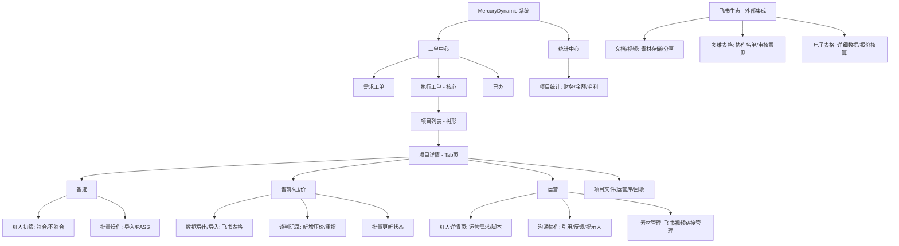

# 执行工单 - 2：系统分析

> 来源视频：执行工单 - 2.mp4
>
> 实际模型：qwen/qwen3.7-flash
>
> OpenRouter 请求 ID：gen-1789726266-hoKMv3c7qJrwy9VWQX0H
>
> 生成时间：2026-09-18T10:12:40.094Z
>
> Token：输入 100364 / 视频 0 / 输出 7402 / 总计 107766
>
> 本次费用：$0.012997

# MercuryDynamic 系统逆向分析报告

## 1. 用户进入页面/模块及页面名称

*   **00:00** 用户进入 **MercuryDynamic** 系统（URL: `heyi.67760.com`），左侧导航栏高亮显示 **“工单中心” -> “执行工单”**。
*   **00:32** 用户跳转至外部系统 **飞书 (Feishu/Lark)** 文档/表格页面 (`dreamtech.feishu.cn`, `ooawOpsmt.feishu.cn`)。
*   **02:32** 用户返回 MercuryDynamic 系统，点击左侧 **“统计” -> “项目统计”**。

## 2. 页面功能与操作分析

### 页面 1：执行工单 (Execute Work Order)
*   **位置**：`/work_order/execute_work_order`
*   **主要功能**：KOL（网红）营销项目的执行管理，涵盖从红人筛选、审核、压价谈判到内容运营的全流程。
*   **布局**：左侧为项目树形列表（客户/项目层级），右侧为项目详情（Tab页签切换）。

#### 关键操作与时间戳：
*   **00:02 - 00:05**：用户在左侧展开 **“Mova”** 项目，选择子项目 **“德国新Mova扫地机”**。
*   **00:05 - 00:08**：右侧顶部显示统计信息（OR阶段数量、待审核、审核完成等）。Tab包括：**备选、售前&压价、运营、项目文件、运营库、回收**。
*   **00:09 - 00:10**：用户点击 **“运营”** Tab，列表显示已确认红人（jessica_ntk, TechGuruFunThomas等），包含红人ID、平台、CPM等数据。
*   **00:10 - 00:13**：点击红人 **“jessica_ntk”**，弹出详情模态框。Tab包括：运营、价格、合约&财务、上线&监控等。内容列展示了详细的运营要求（脚本、拍摄要求）。
*   **00:43 - 00:50**：用户切换项目为 **“新Mova德国S70”**。在 **“备选”** Tab下，以卡片形式展示待审核红人（tech2videoDE, jessyslovelyhome），显示粉丝数、视频缩略图。
*   **00:52 - 01:10**：用户在“备选”Tab对红人进行审核。点击 **“符合”**（大拇指图标），弹出确认框“确定该红人审核通过？”，用户点击“确定”。（推测：红人从备选库移至下一流程或状态变更）。
*   **01:11 - 01:25**：用户点击 **“售前&压价”** Tab。列表显示红人ID、客户总价、售前洽谈状态。用户全选红人，点击 **“批量导入/更新”** 按钮。
*   **01:55 - 02:18**：在“售前&压价”Tab点击红人（berlin.interior）进入 **“售前详情”** 模态框。
    *   在“压价”Tab下，点击 **“+ 新增”**（或类似按钮，弹窗标题为“新增”）。
    *   输入内容：“压价xx美金=合作内容”。
    *   选择“提示人”（用户列表：olive, wendy, yolanda）。
    *   保存记录。
*   **02:23 - 02:32**：用户点击 **“运营”** Tab，查看已运营红人列表，显示客户总价CPM、毛利率等财务数据。
*   **02:43 - 03:02**：在“运营”Tab点击红人 **“sihome_home”**。
    *   在“运营”Tab下，查看脚本要求（“9.7 脚本”）。
    *   点击操作列的 **“引用”**。
    *   弹出“引用”模态框，输入反馈内容“反馈：”，选择类别（重点信息、甲方要求等），选择提示人。
*   **03:08 - 03:13**：用户点击 **“回收”** Tab。列表显示被PASS或淘汰的红人（PASS原因：类型不符），支持“恢复”操作。

### 页面 2：飞书 (Feishu/Lark) 集成操作
*   **00:13 - 00:20**：在系统内点击运营需求中的链接，跳转至飞书视频文档 (`video-MOVA@jessica_ntk.mp4`)。用户点击“...”，选择 **“创建副本至”** 飞书云盘（mova欧区文件夹）。
*   **00:23 - 00:31**：在新副本上点击 **“分享”**，设置权限为“互联网获得链接的人” -> “可阅读”，并 **“复制链接”**。
*   **00:32 - 00:39**：跳转至飞书多维表格/文档（`德国MD KOL 270 项目-Agency协作`）。在“内容审核”Sheet中，找到 jessica_ntk 行，将刚才复制的视频链接粘贴到“draft video(链接)”列。
*   **01:25 - 01:43**：在系统“售前&压价”Tab点击 **“飞书文档”** 按钮，跳转至飞书电子表格（`新Mova德国S70 Roller...`）。查看 Sheet1（红人基础数据）和 Sheet2（详细数据如粉丝量、互动率、受众画像）。
*   **01:43 - 01:54**：跳转至飞书文档（`德国MD KOL 270 项目-Agency协作`）的“KOL待筛选名单”Sheet。用户编辑第73行（Freundship），在“品牌反馈”列输入“2500-3000”。

### 页面 3：项目统计
*   **02:32 - 02:34**：左侧菜单 **“统计” -> “项目统计”**。
*   **功能**：展示自然周/月的财务数据（签约红人金额、上线红人金额、毛利等），按客户（追觅、必胜、Mova等）分组展示。

## 3. 推测解决的业务问题

该系统主要解决 **KOL（网红）营销项目的全生命周期管理** 问题，特别是针对跨境/海外营销（涉及Instagram, YouTube, TikTok等平台，客户如Mova, 追觅等）。

1.  **红人筛选与审核**：从大量红人（OR阶段）中筛选出符合品牌调性的红人（备选 -> 售前）。
2.  **多方协作与数据同步**：业务人员（Agency/品牌方）与运营人员通过飞书表格进行数据对齐（名单、报价、视频素材），系统作为核心枢纽记录状态和沟通。
3.  **价格谈判与记录**：记录与红人的压价过程（OR&压价），对比客户预算与红人报价，计算CPM和毛利率。
4.  **内容管控**：向红人分发详细的拍摄脚本和运营要求（如“9.7 脚本”），并追踪反馈。
5.  **财务统计**：自动汇总项目的签约金额、上线金额和毛利，辅助决策。

## 4. 核心业务流程

1.  **项目创建与红人入库**：在“执行工单”选择项目，红人数据可能通过“执行工单导入”或从飞书表格同步进入“备选”库。
2.  **初筛（备选阶段）**：运营人员在“备选”Tab查看红人数据（粉丝、视频），点击“符合”或“不符合”进行筛选。
3.  **售前谈判（售前&压价阶段）**：
    *   筛选后的红人进入“售前&压价”Tab。
    *   点击“飞书文档”导出/打开详细数据表，进行深度分析（受众画像、历史数据）。
    *   在飞书表格中更新“品牌反馈”或报价。
    *   在系统内记录“压价”结果（新增记录），计算最终合作价格。
4.  **内容运营（运营阶段）**：
    *   确认合作的红人进入“运营”Tab。
    *   运营人员查看需求，通过系统链接获取红人过往视频（飞书文档），复制副本并分享链接，回填至协作表格。
    *   在系统内发布运营需求（脚本），并添加沟通记录（引用、反馈），@相关人员。
5.  **上线与监控**：红人发布内容后，进入“上线&监控”（视频中未详细演示，但在模态框Tab中存在）。
6.  **统计复盘**：在“项目统计”页面查看整体ROI和财务数据。

## 5. 功能清单与证据等级

| 功能点 | 证据等级 | 说明 |
| :--- | :--- | :--- |
| **项目树形管理** | 【视频明确看到】 | 左侧菜单展示客户（Mova, 追觅等）及子项目层级。 |
| **红人备选审核** | 【视频明确看到】 | “备选”Tab，卡片式展示，支持“符合/不符合”点击审核。 |
| **售前压价管理** | 【视频明确看到】 | “售前&压价”Tab，支持新增压价记录，查看历史谈判内容。 |
| **飞书深度集成** | 【视频明确看到】 | 支持创建飞书文档副本、设置分享权限、复制链接；支持从飞书表格导入/导出数据（“飞书文档”按钮）。 |
| **运营需求分发** | 【视频明确看到】 | 红人详情页“运营”Tab，展示脚本内容，支持“新增”、“引用”沟通记录。 |
| **财务统计** | 【视频明确看到】 | “项目统计”页面，展示签约、上线金额及毛利。 |
| **红人数据自动抓取** | 【根据操作合理推断】 | 列表中直接显示粉丝数、CPM、互动率等详细数据，推测系统有API对接或定期爬虫同步。 |
| **一键PASS/审核通过** | 【视频明确看到】 | 按钮存在，但视频中主要演示了逐个点击“符合”图标。 |
| **回收与恢复** | 【视频明确看到】 | “回收”Tab显示被PASS红人，有“恢复”按钮。 |
| **合约&财务模块** | 【无法确认】 | 模态框中有此Tab，但视频中未点击进入详细操作。 |
| **上线&监控模块** | 【无法确认】 | 模态框中有此Tab，视频中未演示具体监控功能（如数据抓取）。 |

## 6. 关键业务实体

*   **Project (项目/工单)**：如“德国新Mova扫地机”、“新Mova德国S70”。
*   **KOL/Influencer (红人)**：如 jessica_ntk, sihome_home。包含ID、平台、粉丝数、报价等。
*   **Work Order (工单/任务)**：针对特定红人的运营任务或审核任务。
*   **Record (沟通记录)**：包含类别（重点信息、压价等）、内容、经办人、时间。
*   **Deliverable (交付物)**：如 1x IG Reel, Link in bio。

## 7. 系统整体功能架构

## 8. 仍需要向客户确认的问题

1.  **数据同步机制**：点击“飞书文档”按钮后，是打开一个只读视图，还是可编辑的副本？编辑后的数据（如飞书表格中的“品牌反馈”）是如何同步回 MercuryDynamic 系统的？是手动同步还是自动同步？
2.  **红人数据来源**：列表中的红人数据（粉丝数、CPM、受众画像）是系统自动通过API抓取（如Instagram Graph API），还是手动从飞书表格导入？
3.  **“备选”到“售前”的流转逻辑**：在“备选”Tab点击“符合”后，红人是自动进入“售前&压价”Tab，还是需要手动操作（如点击“执行工单导入”）？
4.  **权限控制**：视频中用户设置了“互联网获得链接的人可阅读”，系统内是否有更细粒度的权限控制（如只能看自己负责的红人）？
5.  **统计维度**：“项目统计”页面的数据（签约金额、上线金额）是手动录入还是根据工单状态自动计算？
6.  **移动端支持**：该系统是否支持移动端（App或小程序）操作？（视频中主要展示PC端Web操作）。
